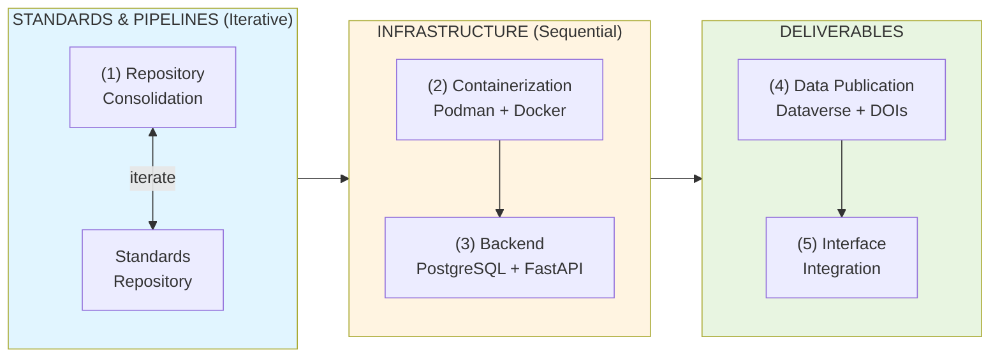

```mermaid
flowchart LR
    subgraph Layer1["STANDARDS & PIPELINES (Iterative)"]
        A1["(1) Repository<br/>Consolidation"] 
        A2["Standards<br/>Repository"]
        A1 <-->|"iterate"| A2
    end
    
    subgraph Layer2["INFRASTRUCTURE (Sequential)"]
        B1["(2) Containerization<br/>Podman + Docker"]
        B2["(3) Backend<br/>PostgreSQL + FastAPI"]
        B1 --> B2
    end
    
    subgraph Layer3["DELIVERABLES"]
        C1["(4) Data Publication<br/>Dataverse + DOIs"]
        C2["(5) Interface<br/>Integration"]
        C1 --> C2
    end
    
    Layer1 --> Layer2
    Layer2 --> Layer3
    
    style Layer1 fill:#e1f5ff
    style Layer2 fill:#fff4e1
    style Layer3 fill:#e8f5e1
```